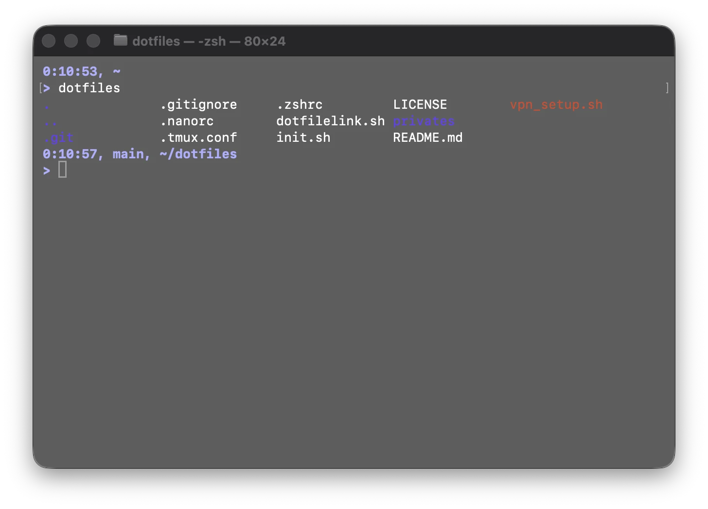

# Dotfiles
環境構築の手間を減らすためのリポジトリ

<p align="center">
    
</p>


## Requirement

- macOS または Linux(Debian)
- Curl


## Usage

```
curl -sf https://raw.githubusercontent.com/Mokuichi147/dotfiles/main/init.sh | sh
```


## Memo

```
chsh -s $(which zsh)
```